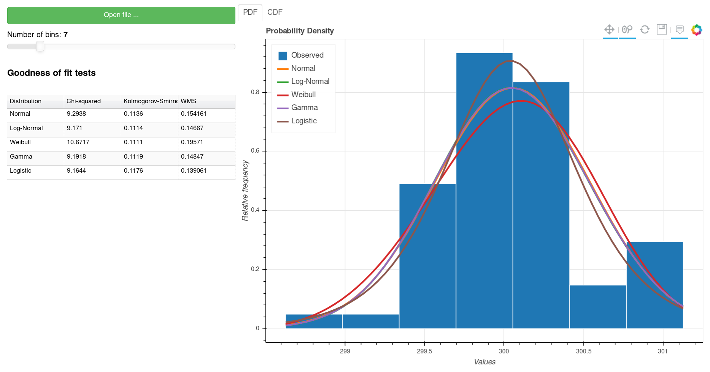

# StatFitWeb

[](https://app.codacy.com/manual/wevertonms/statfitweb?utm_source=github.com&utm_medium=referral&utm_content=wevertonms/statfitweb&utm_campaign=Badge_Grade_Dashboard)


Small python web application for statistical characterization of made with [SciPy](https://docs.scipy.org/doc/scipy/reference/tutorial/stats.html) and [Bokeh](https://bokeh.pydata.org/en/latest/).



# Using

## Install dependencies

If you use Windows, you need to install Python 3 in your system:
 - [Windows 32 bits](https://www.python.org/ftp/python/3.7.3/python-3.7.3.exe)
 - [Windows 64 bits](https://www.python.org/ftp/python/3.7.3/python-3.7.3-amd64.exe)

After that, you need to install the dependencies using the running command bellow in cmd:

```
python3 -m pip install requeriments.txt
```

## Running

```
python3 main.py
```
